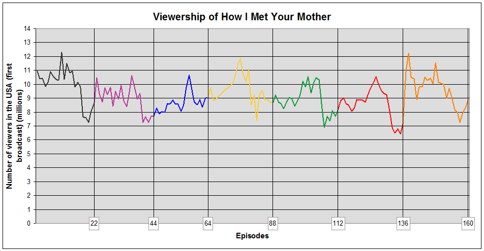

::: {.cell}

````{.cell-code}
```{{r}}
library(chron)
```
````

::: {.cell-output .cell-output-stderr}
```
Warning: package 'chron' was built under R version 4.1.2
```
:::

````{.cell-code}
```{{r}}
library(reticulate)
```
````
:::


------------------------------------------------------------------------

# How I Met Your Mother {.tabset}

*How I Met Your Mother* (often abbreviated as HIMYM) is an American sitcom, created by Craig Thomas and Carter Bays for *CBS*. The series, which aired from September 19, 2005 to March 31, 2014, follows the main character, Ted Mosby, and his group of friends in New York City's Manhattan.


### Basic statistics for *How I met your mother*:

- Running time: 22 minutes
- Number of seasons: 9 
- Number of episodes: 208
- Country of origin: United States
- Genre: Sitcom, Romatic Comedy
- Original language: English

### Viewership over time
<span style="color: red; font-size: 12px">I was not sure how viewership should be provided, thus there will be 2 versions - one is a inserted picture and another is plotted graph with csv file and R code</span>

#### From Wiki


#### With R code


::: {.cell}
::: {.cell-output .cell-output-stderr}
```
Warning: package 'ggplot2' was built under R version 4.1.2
```
:::

::: {.cell-output-display}

:::
:::


#### Viewership description 

The show's viewership saw some fluctuations over its run. The series premiered with 10.94 million viewers in its first season[^1^]. The viewership peaked in season 2 with 12.27 million viewers[^2^] and then experienced a decline, reaching its lowest point in season 6 with 8.31 million viewers[^3^]. The show's viewership then saw a slight increase in later seasons, with season 9 averaging 9.39 million viewers[^4^].

[^1^]: Season 1 viewership: 10.94 million viewers
[^2^]: Season 2 viewership: 12.27 million viewers
[^3^]: Season 6 viewership: 8.31 million viewers
[^4^]: Season 9 viewership: 9.39 million viewers

